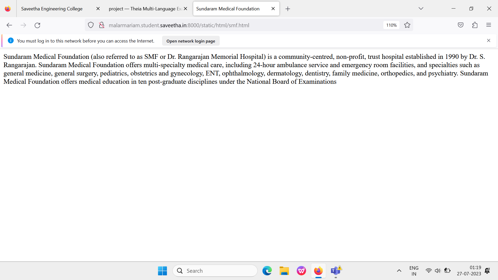
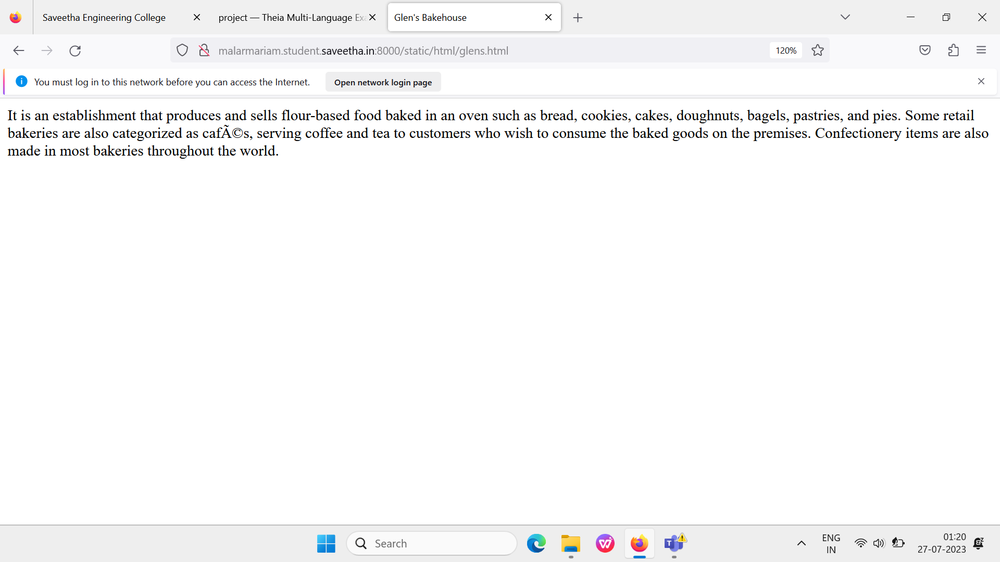
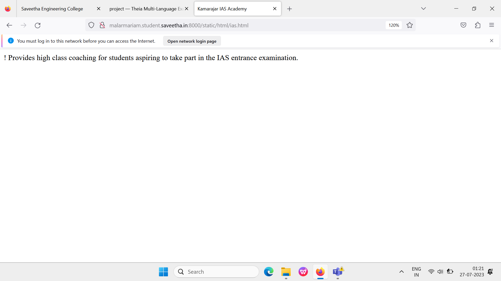
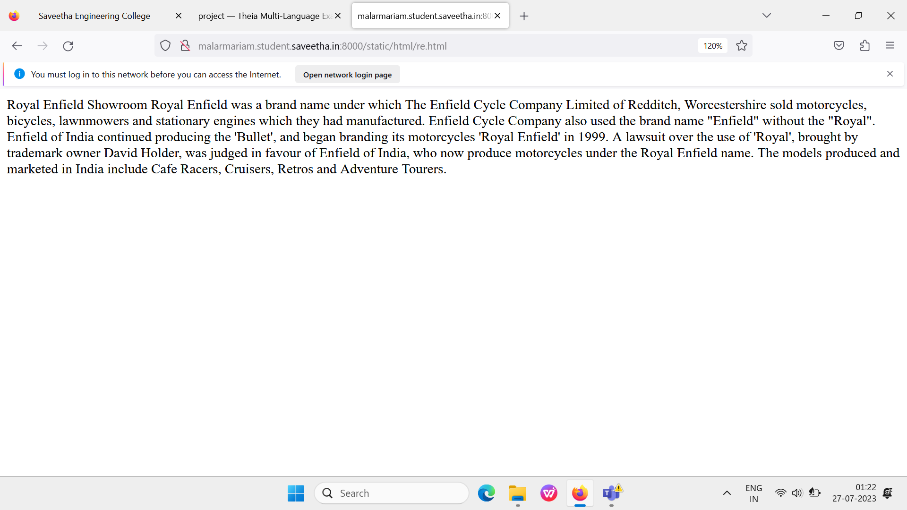
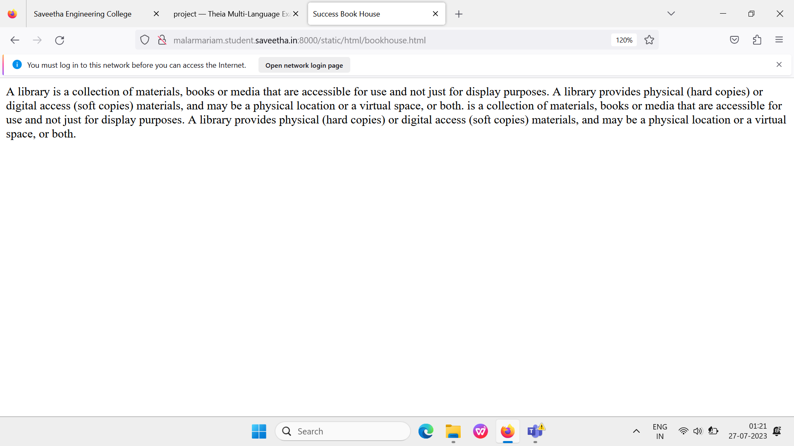

# Places Around Me
## AIM:
To develop a website to display details about the places around my house.

## Design Steps:

### Step 1:
create a folder and clone the repository into that folder

### Step 2:
start a project named myproj and create an app inside it.

### Step 3:
do the required changes in settings.py

### Step 4:
open google maps and take a screenshot of your place, open image map and create a html page for 5 places around your place, get the code and complete index.html in static files.

### Step 5:
then create a html file for each one of the places.

### Step 6:
runserver.

### Step 7:
reposit the same into github using the github commands.

## Code:

### index.html:
```
<!DOCTYPE html>
<html>
    <head>
        <title>
            Places Around Me
        </title>
    </head>
    <body>
        
<map name="image-maps-2023-07-27-060105" id="ImageMapsCom-image-maps-2023-07-27-060105">
<area  alt="" title="Sundaram Medical Foundation" href="smf.html" shape="rect" coords="989,463,1113,548" style="outline:none;" target="_self"     />
<area  alt="" title="Glens Bakehouse" href="glens.html" shape="rect" coords="1658,173,1699,222" style="outline:none;" target="_self"     />
<area  alt="" title="Success Book House" href="bookhouse.html" shape="rect" coords="537,330,607,412" style="outline:none;" target="_self"     />
<area  alt="" title="Royal Enfield Showroom" href="re.html" shape="rect" coords="901,353,946,418" style="outline:none;" target="_self"     />
<area  alt="" title="Kamaraj IAS Academy" href="ias.html" shape="rect" coords="704,238,795,286" style="outline:none;" target="_self"     />
<area shape="rect" coords="1918,1078,1920,1080" alt="Image Map" style="outline:none;" title="Image Map" href="https://www.image-maps.com/" />
</map>
    </body>
</html>
```

### smf.html:
```
<!DOCTYPE html>
<html>
    <head>
        <title>
            Sundaram Medical Foundation
        </title>
    </head>
    <body>
        Sundaram Medical Foundation (also referred to as SMF or Dr. Rangarajan Memorial Hospital) is a community-centred, non-profit, trust hospital established in 1990 by Dr. S. Rangarajan.
        Sundaram Medical Foundation offers multi-specialty medical care, including 24-hour ambulance service and emergency room facilities, and specialties such as general medicine, general surgery, pediatrics, obstetrics and gynecology, ENT, ophthalmology, dermatology, dentistry, family medicine, orthopedics, and psychiatry.
        Sundaram Medical Foundation offers medical education in ten post-graduate disciplines under the National Board of Examinations
    </body>
</html>
```
### re.html:
```
<!DOCTYPE html>
<html>
    <head>
        Royal Enfield Showroom
    </head>
    <body>
        Royal Enfield was a brand name under which The Enfield Cycle Company Limited of Redditch, Worcestershire sold motorcycles, bicycles, lawnmowers and stationary engines which they had manufactured. Enfield Cycle Company also used the brand name "Enfield" without the "Royal".
        Enfield of India continued producing the 'Bullet', and began branding its motorcycles 'Royal Enfield' in 1999. A lawsuit over the use of 'Royal', brought by trademark owner David Holder, was judged in favour of Enfield of India, who now produce motorcycles under the Royal Enfield name. The models produced and marketed in India include Cafe Racers, Cruisers, Retros and Adventure Tourers.
    </body>
</html>
```

### ias.html:
```
<!DOCTYPE html>
<html>
    <head>
        <title>
            Kamarajar IAS Academy
        </title>
    </head>
    <body>
        Provides high class coaching for students aspiring to take part in the IAS entrance examination.
    </body>
</html>
```
### glens.html:
```
<!DOCTYPE html>
<html>
    <head>
        <title>
            Glen's Bakehouse
        </title>
    </head>
    <body>
        It is an establishment that produces and sells flour-based food baked in an oven such as bread, cookies, cakes, doughnuts, bagels, pastries, and pies. 
        Some retail bakeries are also categorized as cafés, serving coffee and tea to customers who wish to consume the baked goods on the premises.
        Confectionery items are also made in most bakeries throughout the world.
    </body>
</html>
```

### bookhouse.html:
```
<!DOCTYPE html>
<html>
    <head>
        <title>
            Success Book House
        </title>
    </head>
    <body>
        A library is a collection of materials, books or media that are accessible for use and not just for display purposes. A library provides physical (hard copies) or digital access (soft copies) materials, and may be a physical location or a virtual space, or both. 
     is a collection of materials, books or media that are accessible for use and not just for display purposes. A library provides physical (hard copies) or digital access (soft copies) materials, and may be a physical location or a virtual space, or both. 
    </body>
</html>
```

## Output:






## Result:
The experiment is successful.